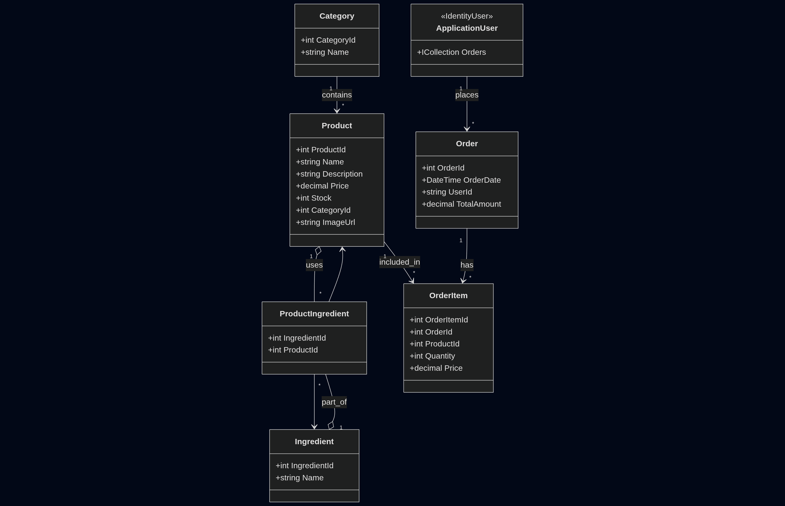

# RestaurantApp

Aplicación web ASP.NET Core MVC para la gestión básica de un restaurante (productos, ingredientes, pedidos, usuarios).

## Descripción

Proyecto con fines de aprendizaje que implementa un catálogo de productos con ingredientes, carrito de compras y gestión de pedidos. Está construido con ASP.NET Core 8 (MVC) y Razor Views, y sigue un patrón típico de aplicación web con inyección de dependencias y repositorios.

Tecnologías y componentes principales:

- **ASP.NET Core 8 (MVC)**: controladores, rutas y vistas Razor para la capa de presentación.
- **Entity Framework Core**: mapeo objeto-relacional, `AppDbContext` y migraciones en la carpeta `Migrations`.
- **ASP.NET Identity**: gestión de usuarios extendida con `ApplicationUser` para autenticación y relación con pedidos.
- **Bootstrap + jQuery**: librerías front-end incluidas en `wwwroot/lib` para estilos y comportamientos UI.
- **Manejo de imágenes**: subida de archivos mediante `IFormFile` y almacenamiento referenciado por `ImageUrl` en `Product`.
- **Base de datos**: por defecto preparada para SQL Server (configurable en `appsettings.json`), pero compatible con otras bases soportadas por EF Core.

## Requisitos

- .NET 8 SDK
- EF Core Tools (opcional para aplicar migraciones desde la CLI)
- Base de datos compatible. Ajustar `ConnectionStrings` en `appsettings.json`.

## Instalación y ejecución

1. Clona el repositorio:

   git clone <url-del-repo>

2. En la carpeta del proyecto, restaura paquetes:

   dotnet restore

3. Configura la cadena de conexión en `appsettings.json` o `appsettings.Development.json` (clave: `ConnectionStrings:DefaultConnection`).

4. Aplicar las migraciones a la base de datos (si queres crear la BD desde las migraciones):

   dotnet tool install --global dotnet-ef --version 8.*  # si no tienes dotnet-ef
   dotnet ef database update

5. Compilar y ejecutar la aplicación:

   dotnet build
   dotnet run

6. Abrir el navegador en `https://localhost:5001` o la URL que muestre la salida.

## Migraciones

Las migraciones están en la carpeta `Migrations/`. Si modificas el modelo:

- Crear nueva migración:

  dotnet ef migrations add NombreDeLaMigracion

- Aplicar migraciones:

  dotnet ef database update

## Estructura del proyecto

- `Controllers/` - controladores MVC
- `Models/` - modelos de dominio y vistas-modelo
- `Data/` - `AppDbContext` y configuración del EF Core
- `Views/` - vistas Razor
- `wwwroot/` - assets estáticos (css, js, imágenes)
- `Migrations/` - migraciones EF Core

## Desarrollo

- Recomendado usar Visual Studio 2022+ o VS Code con soporte para .NET 8.
- Ejecuta la app en el perfil de desarrollo para usar `appsettings.Development.json`.

